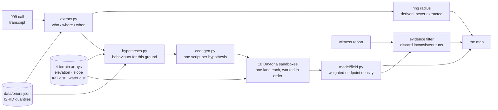

When someone goes missing in the mountains, the first thing a search manager
draws is a circle. Published statistics say a lost hiker is usually found
within a certain distance of where they were last seen, so the circle is where
the teams go. For the Santa Catalina Mountains that radius works out at 9.55 km,
which is 286 square kilometres of Arizona to cover before dark.

The circle is a reasonable summary of a large dataset and a poor description of
any actual person. People follow trails. They avoid ground that is too steep to
cross, they head downhill when they are tired, and they stop at water. A ring
puts equal weight on the cliff face and on the path leading away from it.

Searchlight takes the same published statistics and applies them through the
terrain instead of around it. Twelve thousand simulated people walk the real
elevation model from the last known point, each one following a hypothesis
about what the missing person did. Where many of them end up, the map gets
bright. Then a witness report arrives, every simulation inconsistent with it is
discarded, and the bright region contracts.

The ring stays exactly the same size. That is the whole argument.

---

## The flow


**1. The call.** A transcript comes in, live from the browser's microphone or
replayed from a recording. A model pulls the structured report out of it: who,
where, when, what they were wearing. The search radius is the one field it is
forbidden to produce. That comes from the ISRID quantiles for the extracted
subject category, because a language model inventing a search radius is the
thing this project exists to argue against.


**2. The fan-out.** Hypotheses are proposed for this specific ground, weighted
by published behaviour frequencies, and a model writes the movement code for
each one. Those scripts run in ten isolated Daytona sandboxes against terrain
arrays baked into the machine image, each script re-run under a different seed
until the hypothesis has its share of the twelve thousand.


**3. The field.** Endpoints accumulate into a probability surface, draped over
the terrain and named by the ground it sits on. The headline number is the
smallest region holding 50% of the probability mass, as a percentage of the
ring's area.

**4. The witness.** A sighting arrives. Every trajectory that was not near that
point at that time is discarded, the surface is rebuilt from what survives, and
the number drops again. The dashed ring on the map does not move, because a
ring has no way to respond to evidence.


---

## Run it

No account, no key, no card:

```bash
docker compose up --build
open http://localhost:3000
```

That is the real product. The hypotheses, the movement code, the terrain
arrays, the aggregation and the evidence filter are all the live path, executed
locally rather than in sandboxes. What it gives up is the isolation boundary
and the model-written scripts, so every batch runs a hand-written family
template and reports itself as ungenerated.

Without Docker:

```bash
npm install
python -m venv .venv && .venv/Scripts/activate      # Windows
pip install -r requirements.txt
npm run dev                                          # both halves, offline
```

To use the real fleet and the model calls, put keys in `.env` and set
`SEARCHLIGHT_OFFLINE=0`. Every key is optional and each one degrades on its
own; `.env.example` says what each buys and what happens without it.

```bash
npm run ci        # typecheck, lint, build, and the offline smoke suite
```

---

## How it fits together



The two model calls sit on the left, before any simulation runs. Neither one
touches the statistics: family weights and the ring radius come from
`data/priors.json` in both directions, and a returned hypothesis tagged with a
family outside the published five is dropped. The model proposes variations
within published categories and never invents the structure they sit in.

---

## Engineering decisions

### The sandboxes are load-bearing because a model writes the code

A fixed random walk with different seeds runs twelve thousand times in one
Python process in under a second, which would leave the isolation decorative.
So the model writes the movement code per hypothesis, and what executes across
the fleet is generated code running hundreds of times in parallel. The same
reasoning runs in the other direction offline: `LocalFleet` declines a
generated script and takes the hand-written family template, because executing
model output in the orchestrator's own process would throw away the property
the sandboxes exist to provide.

### Aggregation is incremental, and smoothing is deliberately not

The field streams to the client while the fleet is still working, so
`build_field` holds an opaque accumulator of unsmoothed weighted endpoint
counts and folds in only the batches it has not already seen. Smoothing runs
when a grid is emitted. Doing it on the way in would blur already-blurred data,
and the field would creep outward a little on every update.

The display grid is 256×256 and the scoring grid is 5001×5001 at 5 m cells.
Same function, different resolution argument, and twenty-five million floats
never go anywhere near the socket.

### The probability field is a MapLibre image source

deck.gl renders in its own pass and floats flat above terrain, while MapLibre
drapes its own raster layers onto the ground natively, so the field is a
MapLibre source rather than a deck layer. Within that, `canvas` is the obvious
type for a surface that repaints in place, and it renders correctly at pitch 0.
At pitch 57 over terrain it tears into hard-edged polygons. An `image` source
with byte-identical pixels at identical coordinates, on the same map at the
same camera, drapes cleanly.

Tile residency, quad size and update frequency were each ruled out before the
source type was. The cost of the fix is a PNG encode per update, so
`lib/field.ts` cross-fades two image layers and the 800 ms transition is pure
`raster-opacity`.

### One envelope stream, two producers

The orchestrator sends protocol envelopes over a WebSocket. The fixture source
synthesises the same envelopes from committed JSON. The client reduces one
message shape and has no idea which producer it is talking to, which is what
keeps the offline path exercised instead of rotting the moment live data shows
up.

`docs/CONTRACT.md` defines every message, and the test suite reads the state
machine out of both ends to check they still agree. Section numbers in that
file are cited from a hundred places in the source, so they are stable by rule.

---

## What is measured

The scoring harness reproduces the published ring baseline, which is the check
that the harness itself is right:

| Model | R | |
|---|---|---|
| Published ISRID distance ring | 0.780 | 95% CI 0.74–0.82, n=376 |
| Our ring, all 109 usable cases | 0.711 | 95% CI 0.643–0.779 |
| Our ring, the 6 validation cases | 0.761 | the like-for-like number |

The intervals overlap, and two independent geometry checks passed alongside it:
the DEM's highest cell lands 80 m from Mount Lemmon's surveyed summit at 2,793 m
against a published 2,791 m, and the derived distance quantiles (1.63 / 2.86 /
6.26 km) sit close to Koester's published 1.60 / 3.10 / 6.10.

Fleet numbers, measured against the live Daytona account on 30 August 2026 and
recorded in `pipeline/TIMINGS.json`: ten sandboxes acquired in 2.17 s, 600 of
600 runs returned, 662 simulations per second. The account tier caps total CPU
at 10 and total memory at 10 GiB across all live sandboxes, so a 1 GiB worker
gives a fleet of ten and a 2 GiB worker gives five. Twelve thousand simulations
therefore run in twenty waves of ten rather than all at once.

---

## Limitations

**The field has never been scored.** `validation_result` emits `our_score` as
null, and the UI renders that as pending rather than inventing a number. The
ring baseline above is real and measured. The claim that a terrain-aware field
beats it is untested. Closing the gap means running the six validation cases
through the same harness at 5001×5001, which is a few hours of compute plus the
work to drive the pipeline from a historical IPP instead of from a phone call.

Six cases is also not a sample. The 95% interval on 0.761 runs from 0.52 to
1.0, which is wide enough to be worth saying out loud before anyone quotes the
number. The free MapScore subset holds 131 Arizona cases and 109 usable ones,
but only six sit inside a single terrain window; widening that means fetching a
DEM per case rather than sharing one, roughly a day of pipeline work against a
larger OpenTopography quota.

Terrain cost functions are hand-tuned. Tobler's hiking function is applied to
the grade along the direction of travel, scaled by 0.75 for rough ground and
clamped to 0.20–1.40 m/s. Those constants reproduce plausible displacement
distributions and are fitted to nothing.

The family weights in `data/priors.json` carry a `PLACEHOLDER` flag and say so
in the file itself. Distance quantiles are derived from the case data; the
behaviour frequencies are borrowed.

A witness report is treated as more reliable than real ones are. The filter
takes a `reliability` between 0 and 1 and dims rather than discards below 1,
which is a crude model of a sighting that is simply mistaken.

There is one subject category, one search area and one weather condition. The
lookup in `extract.ring_radius_m` exists so that adding a second category is a
data change rather than a code change, and today it returns the same p95 for
everybody.

Searchlight is decision support. It surfaces hypotheses for a human to act on,
and treating it as a probability oracle would be a misuse of it.

---

## Built by

Three people, one Sunday, at the Daytona HackSprint at Entrepreneurs First in
London on 30 August 2026.

**Bartosz Bielecki** built the entire client: the deck.gl and MapLibre map
canvas that shares one camera matrix with no second view state to reconcile,
the field renderer and its cross-fade, every component and state transition,
the fixture source, and the Playwright harness that drives all seven states in
a real Chrome window and measures the frame rate off the scene's own counter.

**Adam Mascarenhas** built the simulation stack: Daytona fleet control with the
snapshot bake, the lane-per-sandbox dispatch, the code generation path, the
hypothesis planner, the orchestrator pipeline and the WebSocket server.

**Shawn Dsouza** built the data and the model: case extraction from the MapScore
ISRID subset, the priors, the USGS 3DEP elevation model with OpenStreetMap
trails and water rasterised into the four worker arrays, the aggregation and
evidence filter in `model/field.py`, the scoring harness and ring baseline, the
protocol in `docs/CONTRACT.md`, and the live transcription path.

---

## Source

Sava, Twardy, Koester and Sonwalkar, *Evaluating Lost Person Behavior Models*,
Transactions in GIS. Cases from the [MapScore](https://github.com/ctwardy/mapscore)
Arizona subset, which is free to distribute and carries no personal identifiers.
Terrain from USGS 3DEP via OpenTopography, trails and water from OpenStreetMap.

The incident in the screenshots, SL-2084, is fictional and exists to drive the
demonstration. The six validation cases are real.
