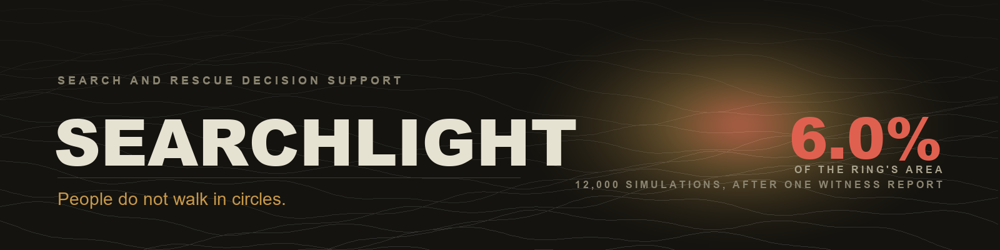
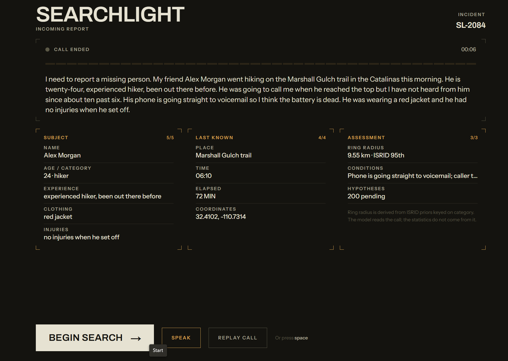
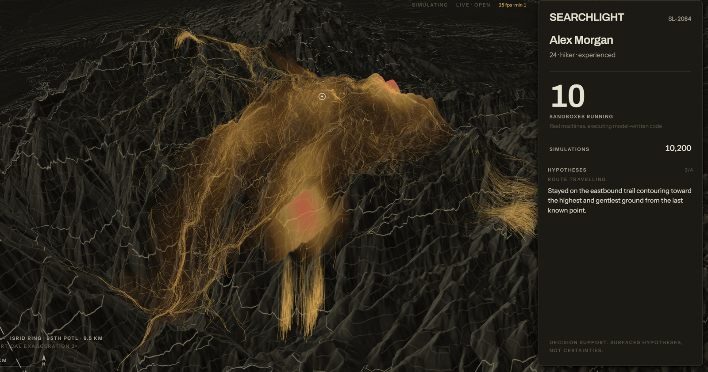
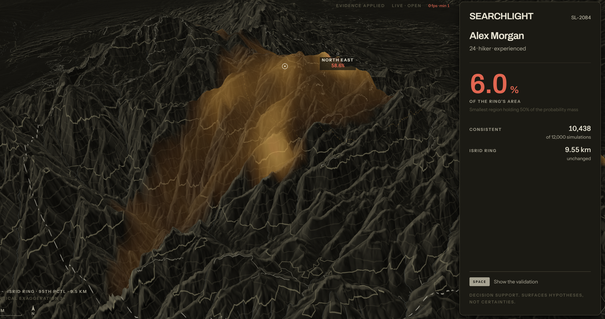
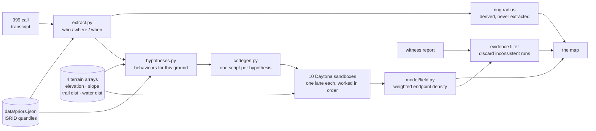

When someone goes missing in the mountains, the first thing a search manager
draws is a circle. Published statistics say a lost hiker is usually found within
a certain distance of where they were last seen, so the circle is where the
teams go. In the Santa Catalina Mountains that radius is 9.55 km: 286 square
kilometres of Arizona to cover before dark.

A circle summarises a large dataset well and describes an actual person badly.
People follow trails. They avoid ground too steep to cross, head downhill when
tired, and stop at water. A ring weights the cliff face and the path leading
away from it exactly the same.

Searchlight applies the same published statistics through the terrain instead of
around it. Twelve thousand simulated people walk the real elevation model from
the last known point, each following a hypothesis about what the missing person
did. Where many of them end up, the map gets bright. A witness report then
discards every simulation inconsistent with it, and the bright region contracts.

The ring stays exactly the same size. That is the whole argument.

---

## The flow


**1. The call.** A transcript arrives, live from the microphone or replayed from
a recording, and a model pulls the report out of it: who, where, when, what they
were wearing.

The search radius is the one field the model is forbidden to produce. That comes
from the ISRID quantiles for the extracted category, because a language model
inventing a search radius is the thing this project argues against.



**2. The fan-out.** Hypotheses are proposed for this specific ground and
weighted by published behaviour frequencies. A model writes the movement code
for each one, and those scripts run in ten isolated Daytona sandboxes against
terrain arrays baked into the machine image.



**3. The field.** Endpoints accumulate into a probability surface, draped on the
terrain and named by the ground it sits on. The headline number is the smallest
region holding 50% of the probability mass, as a percentage of the ring's area.

**4. The witness.** A sighting arrives. Every trajectory that was not near that
point at that time is discarded and the surface is rebuilt from what survives.
The dashed ring does not move, because a ring has no way to respond to evidence.



---

## Run it

No account, no key, no card:

```bash
docker compose up --build        # http://localhost:3000
```

| Command | What it does |
|---|---|
| `docker compose up --build` | Both services, offline, on ports 3000 and 8000 |
| `npm run dev` | The same two halves without Docker |
| `npm run dev:fixtures` | Client alone, replaying committed fixtures |
| `npm run ci` | Typecheck, lint, build, smoke suite |

First time, outside Docker:

```bash
npm install
python -m venv .venv && .venv/Scripts/activate     # Windows
pip install -r requirements.txt
```

To use the real fleet and the model calls, put keys in `.env` and set
`SEARCHLIGHT_OFFLINE=0`. Each key is optional and degrades on its own;
`.env.example` says what each one buys.

### What offline actually runs

|  | Offline (default) | With keys |
|---|---|---|
| Hypotheses | the five published ISRID families | proposed for this terrain |
| Movement code | hand-written family templates | written per hypothesis by a model |
| Execution | thread pool, in the orchestrator | ten isolated Daytona sandboxes |
| Extraction | recorded report, tagged `fallback` | live, from the call |
| Terrain, field, zones, evidence filter | identical | identical |

Offline is a real run rather than a replay. It gives up the isolation boundary
and the generated scripts, and reports every batch as ungenerated so nothing
claims model-written code that never ran.

---

## How it fits together



Both model calls sit on the left, before any simulation runs, and neither one
touches the statistics. A returned hypothesis tagged with a family outside the
published five is dropped, so the model proposes variations within published
categories and never invents the structure they sit in.

---

## Engineering decisions

**The sandboxes are load-bearing because a model writes the code.** A fixed
random walk with different seeds runs twelve thousand times in one process in
under a second, which would leave the isolation decorative. Offline applies the
same reasoning in reverse: `LocalFleet` declines a generated script and takes
the template, rather than executing model output in the orchestrator's own
process.

**Aggregation is incremental; smoothing deliberately is not.** `build_field`
holds an accumulator of unsmoothed endpoint counts and folds in only the batches
it has not seen, so the field streams while the fleet is still working.
Smoothing runs at emit time. Doing it on the way in would blur already-blurred
data and the field would creep outward on every update.

The display grid is 256x256 and the scoring grid is 5001x5001 at 5 m cells. Same
function, different resolution argument, and twenty-five million floats never go
near the socket.

**The probability field is a MapLibre image source.** deck.gl renders in its own
pass and floats flat above terrain, while MapLibre drapes raster layers onto the
ground natively. Within MapLibre, `canvas` is the obvious type for a surface
that repaints in place and it renders correctly at pitch 0, but at pitch 57 it
tears into hard-edged polygons. An `image` source with byte-identical pixels at
identical coordinates drapes cleanly.

Tile residency, quad size and update frequency were each ruled out first. The
fix costs a PNG encode per update, so `lib/field.ts` cross-fades two image
layers and the 800 ms transition is pure `raster-opacity`.

**One envelope stream, two producers.** The orchestrator sends protocol
envelopes over a WebSocket and the fixture source synthesises the same envelopes
from committed JSON. The client reduces one message shape and cannot tell which
producer it is talking to, which keeps the offline path exercised rather than
rotting the moment live data appears.

`docs/CONTRACT.md` defines every message. The test suite reads the state machine
out of both ends to check they still agree.

---

## What is measured

Reproducing the published ring baseline is the check that the scoring harness
itself is right:

| Model | R | |
|---|---|---|
| Published ISRID distance ring | 0.780 | 95% CI 0.74-0.82, n=376 |
| Our ring, all 109 usable cases | 0.711 | 95% CI 0.643-0.779 |
| Our ring, the 6 validation cases | 0.761 | the like-for-like number |

The intervals overlap. Two independent geometry checks passed alongside it: the
DEM's highest cell lands 78 m from Mount Lemmon's surveyed summit at 2,793 m
against a published 2,791 m, and the derived distance quantiles of 1.63 / 2.86 /
6.26 km sit close to Koester's published 1.60 / 3.10 / 6.10.

Fleet numbers, measured against the live Daytona account on 30 August 2026 and
recorded in `pipeline/TIMINGS.json`:

| | |
|---|---|
| Ten sandboxes acquired | 2.17 s |
| Runs returned | 600 of 600 |
| Throughput | 662 simulations per second |
| Account ceiling | 10 total CPU, 10 GiB total memory |

A 1 GiB worker therefore gives a fleet of ten and a 2 GiB worker gives five, so
twelve thousand simulations run in twenty waves rather than all at once.

---

## Limitations

| | What closing it takes |
|---|---|
| **The field has never been scored.** `validation_result` emits `our_score` as null and the UI renders it as pending. The ring baseline is measured; the claim that a terrain-aware field beats it is untested. | A scoring run at 5001x5001, driven from a historical IPP rather than a call. A few hours of compute. |
| **Six validation cases is not a sample.** The 95% interval on 0.761 runs from 0.52 to 1.0. Only six of the 109 usable Arizona cases sit inside one terrain window. | A DEM per case instead of one shared window. About a day of pipeline work. |
| **The constants are chosen, not fitted.** Tobler's function is scaled by 0.75 and clamped to 0.20-1.40 m/s, and the family weights in `data/priors.json` carry a `PLACEHOLDER` flag. Distance quantiles are derived from the case data; behaviour frequencies are borrowed. | Fitting against find locations, which needs the scoring run above to exist first. |

Searchlight is decision support. It surfaces hypotheses for a human to act on,
and treating it as a probability oracle would be a misuse of it.

---

## Built by

Three people, one Sunday, at the Daytona HackSprint at Entrepreneurs First in
London on 30 August 2026.

| | Built |
|---|---|
| **Bartosz Bielecki** | The entire client. The deck.gl and MapLibre canvas sharing one camera matrix, the field renderer and its cross-fade, every component and state transition, the fixture source, and a Playwright harness that drives all seven states in real Chrome and measures frame rate off the scene's own counter. |
| **Adam Mascarenhas** | The simulation stack. Daytona fleet control with the snapshot bake, lane-per-sandbox dispatch, the code generation path, the hypothesis planner, the orchestrator pipeline and the WebSocket server. |
| **Shawn Dsouza** | The data and the model. Case extraction from the MapScore ISRID subset, the priors, USGS 3DEP elevation with OpenStreetMap trails and water rasterised into the four worker arrays, the aggregation and evidence filter in `model/field.py`, the scoring harness and ring baseline, the protocol in `docs/CONTRACT.md`, and the live transcription path. |

---

## Source

Sava, Twardy, Koester and Sonwalkar, *Evaluating Lost Person Behavior Models*,
Transactions in GIS. Cases from the [MapScore](https://github.com/ctwardy/mapscore)
Arizona subset, free to distribute and carrying no personal identifiers. Terrain
from USGS 3DEP via OpenTopography; trails and water from OpenStreetMap.

The incident in the screenshots, SL-2084, is fictional. The six validation cases
are real.
